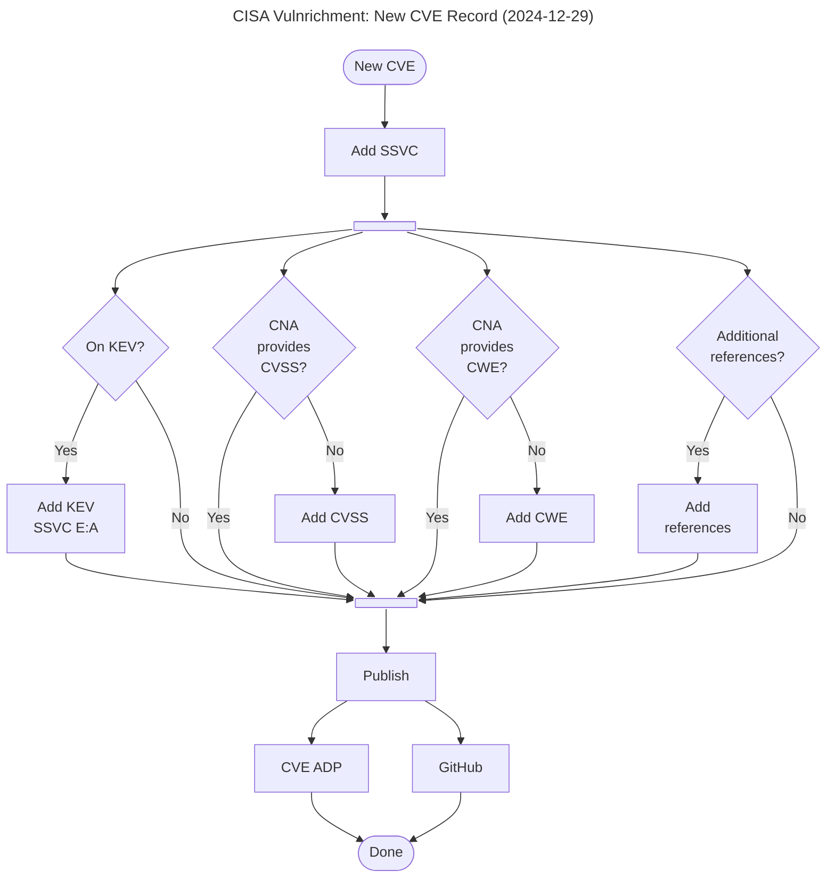
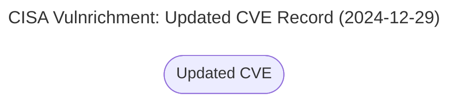

# Flowcharts

Maybe offer rendered .svg or .png? If so, here's how:

```
npm install -g @mermaid-js/mermaid-cli
mmdc -i vulnrichment_new_cve.mermaid -o vulnrichment_new_cve.svg -b transparent -t neutral
mmdc -i vulnrichment_new_cve.mermaid -o vulnrichment_new_cve.svg
mmdc -i vulnrichment_new_cve.mermaid -o vulnrichment_new_cve.png
```

This is the flowchart for processing new CVE Records. 



This is the flowchart for processing updated CVE Records.


