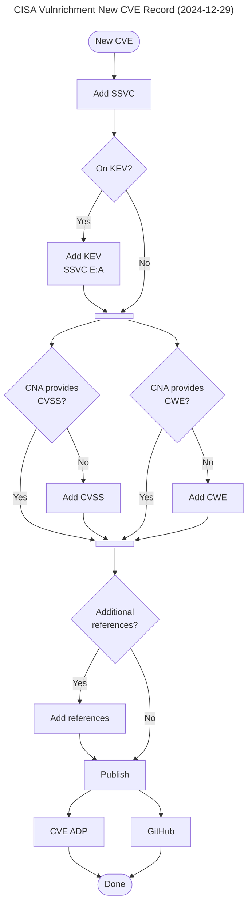

# Flowcharts

This is the flowchart for processing new CVE Records

```mermaid
---
title: "CISA Vulnrichment New CVE Record (2024-12-29)"
---
flowchart TD
    new_CVE@{ shape: stadium, label: "New CVE"}
    add_SSVC@{ shape: rect, label: "Add SSVC" }
    on_KEV@{ shape: diamond, label: "On KEV?" }
    add_KEV@{ shape: rectangle, label: "Add KEV \n SSVC E:A" }
    fork@{ shape: fork }
    cna_CVSS@{ shape: diamond, label: "CNA provides \n CVSS?" }
    cna_CWE@{ shape: diamond, label: "CNA provides \n CWE?" }
    add_CVSS@{ shape: rectangle, label: "Add CVSS" }
    add_CWE@{ shape: rectangle, label: "Add CWE" }
    join@{ shape: join }
    new_refs@{ shape: diamond, label: "Additional \n references?" }
    add_refs@{ shape: rectangle, label: "Add references"}
    publish@{ shape: rectangle, label: "Publish" }
    adp@{ shape: rectangle, label: "CVE ADP" }
    github@{ shape: rectangle, label: "GitHub" }
    done@{ shape: stadium, label: "Done"}
    new_CVE --> add_SSVC
    add_SSVC --> on_KEV
    on_KEV --> | Yes | add_KEV
    on_KEV --> | No | fork
    add_KEV --> fork
    fork --> cna_CVSS
    fork --> cna_CWE
    cna_CVSS --> | Yes | join
    cna_CVSS --> | No | add_CVSS
    cna_CWE --> | Yes | join
    cna_CWE --> | No | add_CWE
    add_CVSS --> join
    add_CWE --> join
    join --> new_refs
    new_refs --> | Yes | add_refs
    new_refs --> | No | publish
    add_refs --> publish
    publish --> adp
    publish --> github
    adp --> done
    github --> done
```
